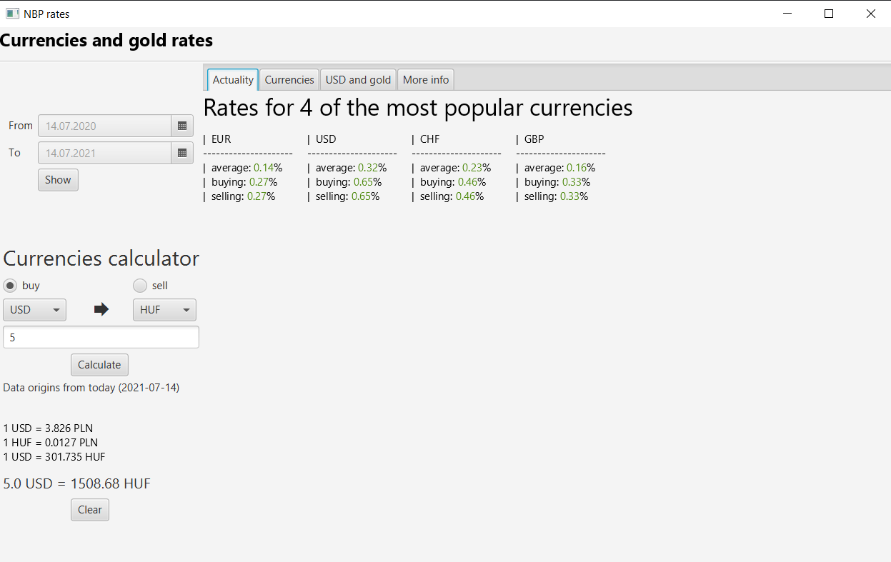
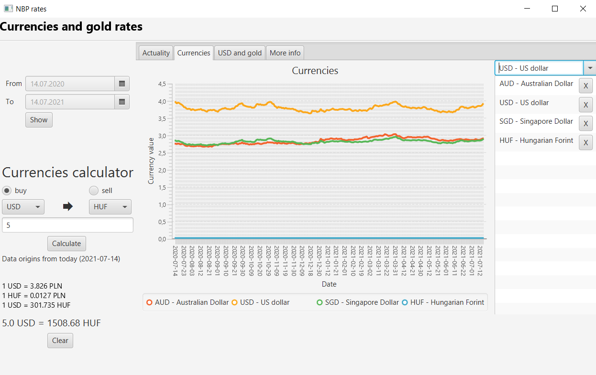
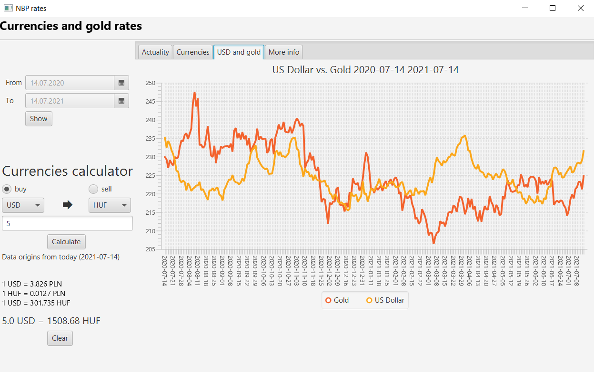
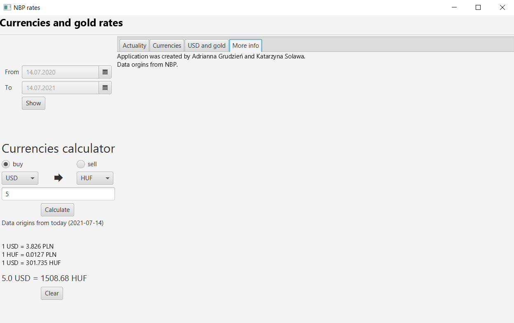

# Currency-App
This projct was created for course Advanced object-oriented and functional programming. Created by Katarzyna Solawa and Adrianna Grudzień. App collect data from http://api.nbp.pl/en.html and use them to visualizie changes and calculate convertion of currencies.

# Usage
1. Clone repo
2. Run `Window.java` located in `kody\currencies\src\pl\edu\mini\pw\zpoif\projectCurrencies\app`

## About app
App is divident into two parts: 
- left with period selector and calculator
- right with four tabs

### *Actuality* - shows how changed rates of four currencies: Euro, US dollar, Swiss Frac and British Pound

### *Currencies* - shows values of selected from list currencies

### *USD and Gold* - shows graph that compares the prices of the dollar with the prices of gold 

### *More info* - contains info about authors and source

# Authors

Katarzyna Solawa - https://github.com/solawak

Adrianna Grudzień - https://github.com/grudziena
